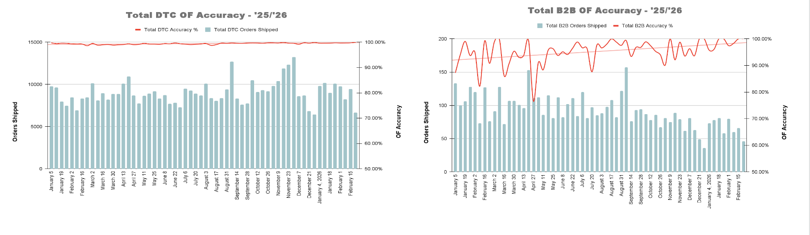
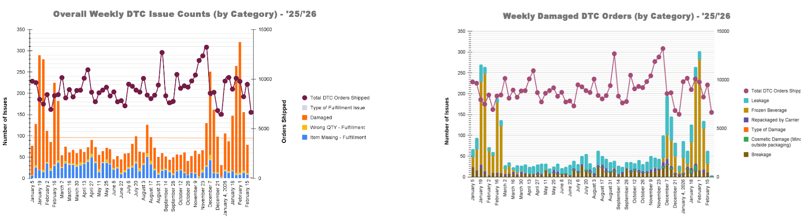
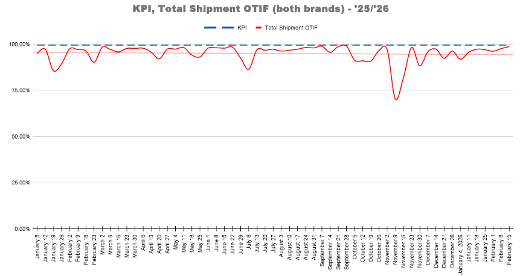

# ecomm-fulfillment-analytics
Operational analytics framework for monitoring fulfillment accuracy, issue trends, and OTIF performance across DTC and B2B channels.

## Metrics Monitored

• Order fulfillment accuracy  
• Weekly operational issue counts  
• Damage classification by category  
• DTC & B2B fulfillment error tracking  
• OTIF (On-Time-In-Full) performance

## Overview

This project analyzes ops performance for e-commerce order fulfillment, focusing on order accuracy, issue trends, damage root causes, and OTIF service levels.

The goal is to provide issue visibility and detect process failures that may impact customer experience and/or fulfillment efficiency.

## Operational Context

Orders are fulfilled across both direct-to-consumer (DTC) and business-to-business (B2B) sales channels.

Operational monitoring focuses on identifying fulfillment errors, damage incidents, and service-level deviations that occur during order processing and shipment handling.

## Order Fulfillment Accuracy

Order accuracy represents the percentage of orders shipped without picking, packing, or labeling errors.

Tracking this metric at the weekly level provides early detection of potential operational process failures.

<ins>DTC & B2B Order Fulfillment Accuracy</ins>

## Issue Trend Analysis

Operational issues are categorized and tracked weekly to identify recurring fulfillment errors such as damaged products, incorrect quantities packed, or items missing from orders. Monitoring issue volume in tandem order throughput helps distinguish between isolated incidents and systemic process problems.

Damage incidents were further categorized to identify underlying drivers such as breakage, leakage, carrier repackaging, and frozen beverage exposure. Tracking these categories separately helps identify packaging failures, carrier handling issues, and potential manufacturing inconsistencies.

<ins>Weekly DTC Fulfillment Issues by Category & Damage Root Cause Analysis</ins>

## OTIF Service Level Performance

OTIF (On-Time-In-Full) measures the reliability of the fulfillment process by tracking whether orders are shipped on time and complete.

This KPI is monitored against operational targets to ensure consistent service performance.

## The "Why"

This monitoring framework supports ops teams by:

• Detecting fulfillment accuracy degradation early

• Identifying root causes of shipment damage

• Tracking operational issue trends over time

• Monitoring service reliability through OTIF performance

These insights help guide process improvements across both manufacturing & fulfillment operations.

## Observed Trends

Analysis of weekly operational metrics revealed several recurring patterns:

• Order fulfillment accuracy remained consistently above 99% for DTC orders. B2B accuracy showed greater week-to-week variability due to lower order volume, employee turnover, and occasional misattribution of SKU identifiers in ShipStation. Identification of said discrepancies prompted a targeted audit of affected SKUs and subsequent correction of labeling & data integrity issues.

• Damage incidents clustered around specific categories such as breakage, leakage, and frozen beverages. Recurring damage patterns suggested a combination of packaging limitations, carrier handling variability, and potential in-house manufacturing inconsistencies. Trends related to frozen beverage shipments ultimately led to the adoption of insulated corrugate packaging to mitigate temperature related damage during winter months (Q4 '25).

• OTIF performance generally remained near operational targets. That said, they exhibited short term declines during periods of elevated order volume, particularly during Black Friday ('25).

## Analytical Approach

Operational metrics were tracked weekly across both DTC and B2B fulfillment channels to identify deviations in order accuracy, issue frequency, and service-level performance.  

Trend analysis was used to isolate recurring operational anomalies and connect them to potential root causes within warehouse processes, in-house manufacturing, or order processing systems.

