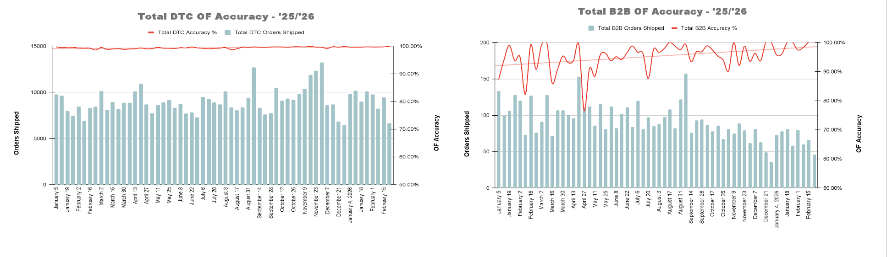
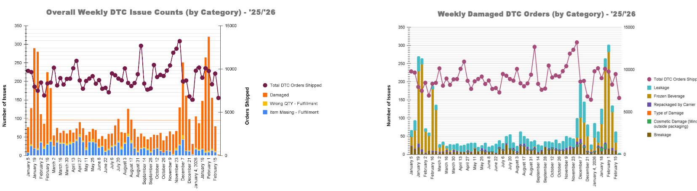
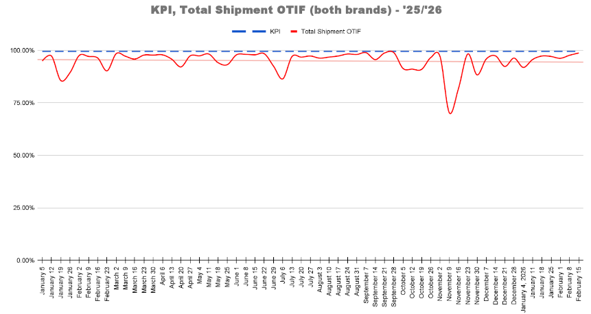

# ecomm-fulfillment-analytics
Operational analytics framework for monitoring fulfillment accuracy, issue trends, and OTIF performance across DTC and B2B channels.

## What was tracked -

• Order fulfillment accuracy  
• Weekly operational issue counts  
• Damage classification and RCA  
• DTC & B2B error trends  
• OTIF (On-Time-In-Full) performance

## What this model  does

In E-Commerce, fulfillment issues tend to get lost in the mix until they compound. This model reveals them early and ties them back to likely causes.

This project analyzes ops performance for e-commerce order fulfillment, focusing on order accuracy, issue trends, damage root causes, and OTIF service levels.

## Operational fulfillment accuracy

Orders are fulfilled across both DTC and B2B sales channels.

This metric is tracked weekly as the percentage of orders shipped without picking, packing, or labeling errors.

## Order Fulfillment Accuracy

Order accuracy represents the percentage of orders shipped without picking, packing, or labeling errors.

Tracking this metric at the weekly level provides early detection of potential operational process failures.

<ins>DTC & B2B Order Fulfillment Accuracy</ins>

## Issue trend analysis

Operational issues are categorized weekly alongside order throughput. 

Damage incidents were categorized to identify underlying issues such as breakage, leakage, carrier repackaging, and frozen beverage. Tracking these categories separately helps identify packaging failures, carrier handling, or something upstream in manufacturing.

<ins>Weekly DTC Fulfillment Issues by Category & Damage Root Cause Analysis</ins>

## OTIF performance

OTIF (On-Time-In-Full) measures whether or not orders ship on time.

This KPI is monitored against SLA targets (in this case, 99.5%) to catch service level drift.

## What the data actually showed

Analysis of weekly operational metrics revealed several recurring patterns:

• Order fulfillment accuracy remained consistently above 99% for DTC orders. B2B accuracy showed greater week-to-week variability due to lower order volume, employee turnover, and occasional misattribution of SKU identifiers in ShipStation. Identification of said discrepancies prompted a targeted audit of affected SKUs and subsequent correction of labeling & data integrity issues.

• Damage incidents clustered around specific categories such as breakage, leakage, and frozen beverages. Recurring damage patterns suggested a combination of packaging limitations, carrier handling variability, and potential in-house manufacturing inconsistencies. Trends related to frozen beverage shipments ultimately led to the adoption of insulated corrugate packaging to mitigate temperature related damage during winter months (Q4 '25).

• OTIF performance generally remained near operational targets. That said, they exhibited short term declines during periods of elevated order volume, particularly during Black Friday ('25).

## Analytical Approach

Operational metrics were tracked weekly across both DTC and B2B fulfillment channels to identify deviations in order accuracy, issue frequency, and service-level performance.  

Trend analysis was used to isolate recurring operational anomalies and connect them to potential root causes within warehouse processes, in-house manufacturing, or order processing systems.

